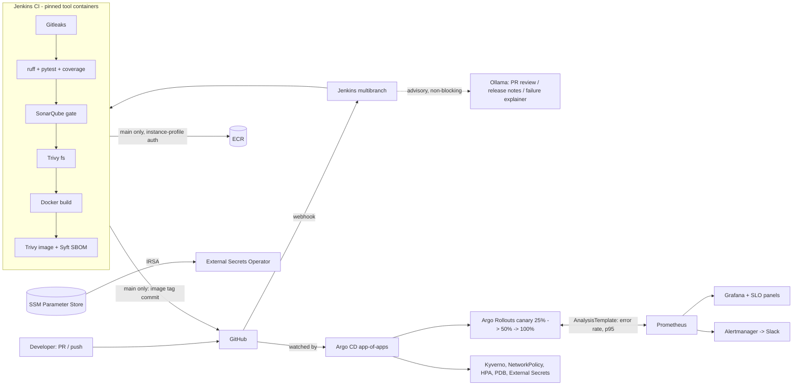

# Architecture

## Trust boundaries
- Jenkins talks to AWS only through its EC2 **instance profile** (ECR push to two repos). No stored access keys.
- Jenkins never runs `kubectl`. It only edits Git; Argo CD pulls and applies.
- Cluster workloads get AWS access through **IRSA** (pod-level roles), not node roles.
- The LLM sees a redacted, size-capped diff and can only write a comment.
